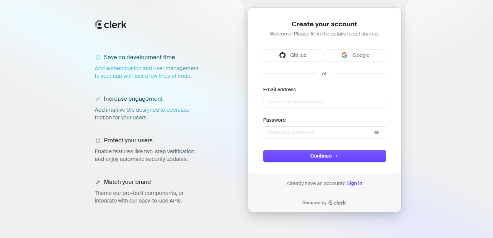
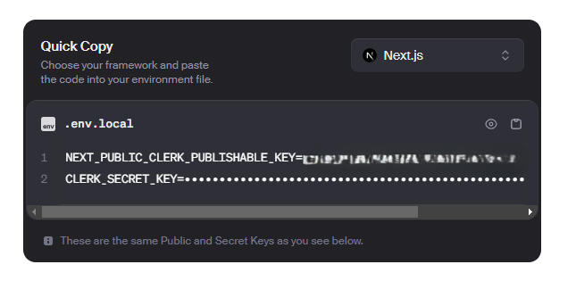
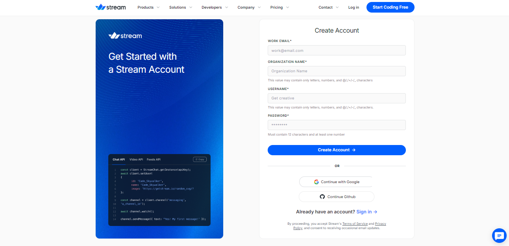
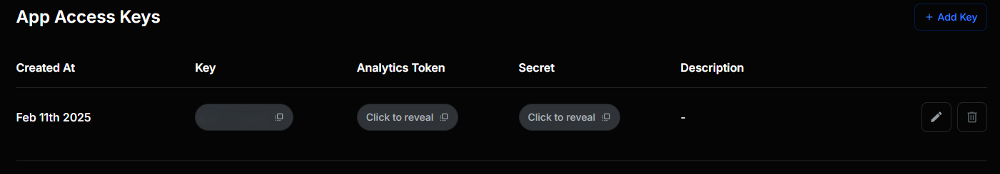

# Crow Call  
## 😺 Introdução  

Bem-vindo ao **Crow Call**, um projeto criado para aprendizado e compartilhamento! Todo o conteúdo aqui está disponível para que você use como quiser, seja para estudo ou para criar suas próprias soluções.  

  


https://github.com/user-attachments/assets/eff44841-e0b8-42b2-b14d-261234bf2b34


> Inspirado no Zoom, o **Crow Call** permite que você crie videochamadas, agende reuniões e até grave suas conversas.  

---

## 👨‍💻 Tecnologias utilizadas  

Este projeto foi desenvolvido com as seguintes tecnologias e ferramentas incríveis:  

- **TypeScript**  
- **Next.js**  
- **Clerk**  
- **GetStream**  
- **Tailwind CSS**  
- **Shadcn**  

---

## 🤔 Preciso baixar todos esses aquivos para conseguir usar o **Crow Call**?
 
 Você pode usar o site [Crow Call](https://crow-call.vercel.app/) e já realizar suas videochamadas, mas se quiser baixar e criar o seu próprio site é só  seguir o passo a passo abaixo. 😉


## 💻 Pré-requisitos  

Antes de começar, certifique-se de atender aos seguintes requisitos:  

- Você tem a versão mais recente do **Node** instalada.  
- Está usando um sistema operacional compatível (**Windows**, **Linux** ou **Mac**).  

---

## ☕ Usando o Crow Call  

Para começar a usar o **Crow Call**, siga os passos abaixo:  

1. **Instale as dependências:**  
```bash
npm install
```

2. Crie um arquivo .env:
```env
NEXT_PUBLIC_CLERK_PUBLISHABLE_KEY=
CLERK_SECRET_KEY=

NEXT_PUBLIC_CLERK_SIGN_IN_URL=/sign-in
NEXT_PUBLIC_CLERK_SIGN_UP_URL=/sign-up

NEXT_PUBLIC_STREAM_API_KEY=
STREAM_SECRET_KEY=
```
3. Crie uma conta no Clerk:
   


4. Copie as duas keys e cole em:



```env
NEXT_PUBLIC_CLERK_PUBLISHABLE_KEY=
CLERK_SECRET_KEY=
```
5. Crie uma conta no GetStream:



6. Copie as duas keys e cole em:



```env
NEXT_PUBLIC_STREAM_API_KEY=
STREAM_SECRET_KEY=
```

## 🎉 Pronto!
Agora é só usar o Crow Call e aproveitar ao máximo todas as suas funcionalidades! 😁


## 📝 Licença

Esse projeto está sob licença. Veja o arquivo [LICENÇA](LICENSE.md) para mais detalhes.
