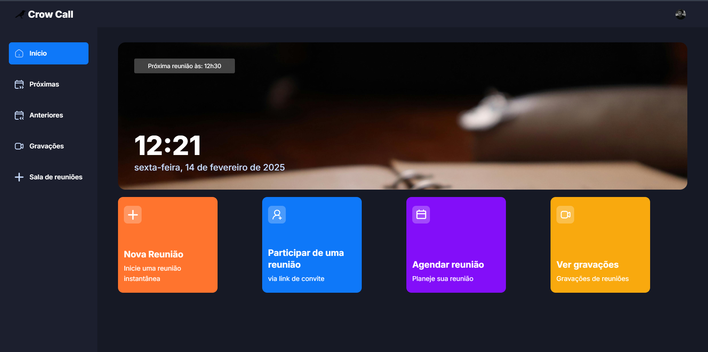

# Crow Call




> Projeto inspirado no Zoom, onde é possivel criar videochamadas, agendar e gravar.

## 💻 Pré-requisitos

Antes de começar, verifique se você atendeu aos seguintes requisitos:

- Você instalou a versão mais recente de `Node`
- Você tem uma máquina `<Windows / Linux / Mac>`.

## ☕ Usando Crow Call

Para usar Crow Call, siga estas etapas:

1. Instale as dependencias:
```

npm install

```
2. Crie um arquivo .env:
```env
NEXT_PUBLIC_CLERK_PUBLISHABLE_KEY=
CLERK_SECRET_KEY=

NEXT_PUBLIC_CLERK_SIGN_IN_URL=/sign-in
NEXT_PUBLIC_CLERK_SIGN_UP_URL=/sign-up

NEXT_PUBLIC_STREAM_API_KEY=
STREAM_SECRET_KEY=
```
3. Crie uma conta no Clerk:
   


4. Copie as duas keys e cole em:


```env
NEXT_PUBLIC_CLERK_PUBLISHABLE_KEY=
CLERK_SECRET_KEY=
```
5. Crie uma conta no Stream:


6.Copie as duas keys e cole em:


```env
NEXT_PUBLIC_STREAM_API_KEY=
STREAM_SECRET_KEY=
```

## 📝 Licença

Esse projeto está sob licença. Veja o arquivo [LICENÇA](LICENSE.md) para mais detalhes.
